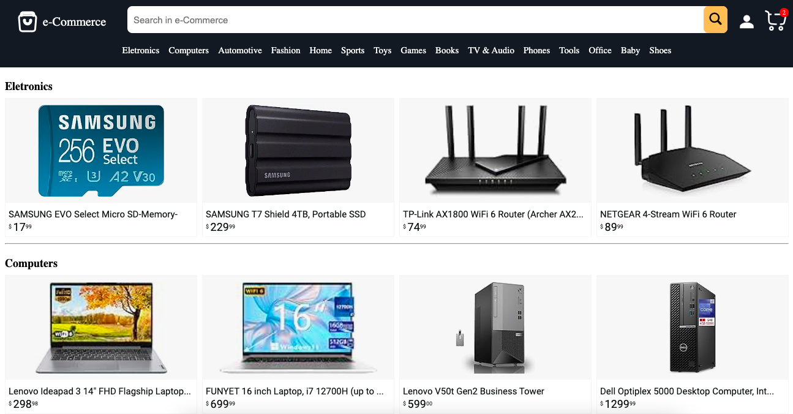

<h1 align="center">🛒 e-Commerce 🛍</h1>

  

<h2>
This was a project is a mock of a e-commerce web page where you can simulate the process of buying online.
</h2>

## 💻 Project

This project consists of a fictitious e-commerce with the following funcionalities:

<ul>
  <li>
    Navigate through product categories.
  </li>
  <li>
    Search for products.
  </li>
  <li>
    Register and login to the platform.
  </li>
  <li>
    Choose the characteristics of the product to buy.
  </li>
  <li>
  Add products to the shopping cart.
  </li>
    <li>
  Conclude the purchase.
  </li>
    <li>
  See user shopping history.
  </li>
 </ul>

## 🚀 Technologies

This project was developed using the following technologies:

- HTML e CSS
- JavaScript
- React
- NodeJS
- TypeScript
- Git e Github

## 🔖 How to access it

- Download the zip file, download the modules needed with <code>npm install</code>, run <code>npm run dev</code> and <code>npm run server</code> on the terminal and access localhost on a browser.
